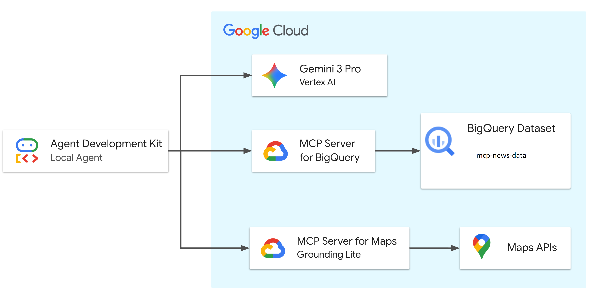
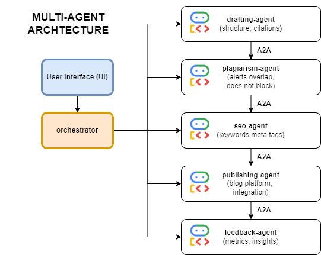

# Launch My blog: Google remote MCP demo 

[](https://cloud.google.com/blog/products/ai-machine-learning/announcing-official-mcp-support-for-google-services)
[](https://codelabs.developers.google.com/adk-mcp-bigquery-maps#0)
[](https://www.youtube.com/watch?v=wzccErUYhTI&t=1s)

This directory contains the data artifacts and infrastructure setup scripts for the **MCP support for BigQuery & Google Maps** demo.  

## Demo Overview

This scenario demonstrates an AI Agent's ability to orchestrate enterprise data (BigQuery) and real-world geospatial context (Google Maps) to solve a complex business problem: 

> **"What are the latest blog topics?"**

The agent autonomously queries BigQuery to find blogs and uses Google Maps to validate micro-location details. The demo relies below key datasets:

1.  **mcp-drafting-data:** To identify the blog content as per input given by user.
2.  **mcp-plagiarism-data:** To identify overlapping content for plagiarism.
3.  **seo datasets:** To fix the seo, organize keywords and metatags etc.
4.  **mcp-publishing-data:** To publish the final content on blogging platform and fetch the blog data and status of 
5.  **mcp-feedback-data:** To analyze feedback from users and blog readers.


### Architecture Diagram



The diagram above illustrates the flow of information in this demo. The Agent, powered by Gemini 3 Pro Preview, orchestrates requests between the user and Google Cloud services. It uses a remote (Google hosted) MCP server to securely access BigQuery for mcp-news-data, and Google Maps APIs for real-world location analysis and validation.

 a representation of your refined blogging pipeline:


## Repository Structure

```text
launchmynews/
├── data/                        # Pre-generated CSV files for BigQuery
│   ├── mcp-drafting-data.csv
│   ├── mcp-plagiarism-data.csv
│   ├── mcp-seo-data.csv
│   ├── mcp-publishing-data.csv
│   ├── mcp-feedback-data.csv
├── adk_agent/                   # AI Agent Application (ADK)
│   └── mcp_drafting_app/        # App directory
│       ├── Dockerfile           # Dockerfile
│       ├── requirements.txt     # requirements
│       ├── agent.py             # Agent definition
│       └── tools.py             # Custom tools for the agent
│   └── mcp_plagiarism_app/      # App directory
│       ├── Dockerfile           # Dockerfile
│       ├── requirements.txt     # requirements
│       ├── agent.py             # Agent definition
│       └── tools.py             # Custom tools for the agent
│   └── mcp_seo_app/             # App directory
│       ├── Dockerfile           # Dockerfile
│       ├── requirements.txt     # requirements
│       ├── agent.py             # Agent definition
│       └── tools.py             # Custom tools for the agent
│   └── mcp_publishing_app/      # App directory
│       ├── Dockerfile           # Dockerfile
│       ├── requirements.txt     # requirements
│       ├── agent.py             # Agent definition
│       └── tools.py             # Custom tools for the agent
│   └── mcp_feedback_app/        # App directory
│       ├── Dockerfile           # Dockerfile
│       ├── requirements.txt     # requirements
│       ├── agent.py             # Agent definition
│       └── tools.py             # Custom tools for the agent
│   └── orchestrator/            # App directory
│       ├── Dockerfile           # Dockerfile
│       ├── requirements.txt     # requirements
│       ├── orchestrator.py      # Agent definition
│   └── frontend/                # App directory
│       ├── my-blog-react        # Agent definition
├── setup/                       # Infrastructure setup scripts
│   ├── setup_bigquery.sh        # Script to provision BigQuery dataset and tables
│   └── setup_env.sh             # Script to set up environment variables
├── cleanup/                     # Infrastructure clean up environment
│   ├── cleanup_env.sh           # Script to remove resources in environment
└── README.md                    # This documentation
```


## Prerequisites

*   **Google Cloud Project** with billing enabled.
*   **Google Cloud Shell** (Recommended) or a local terminal with the `gcloud` CLI installed.

## Deployment Guide

Refer: https://codelabs.developers.google.com/adk-mcp-bigquery-maps?hl=en#5

OR

Follow these steps in **Google Cloud Shell** to provision the demo environment.

### 1. Clone the Repository
```bash
git clone https://github.com/google/mcp.git
cd mcp/examples/launchmynews
```

### 2. Authenticate with Google Cloud

Run the following command to authenticate with your Google Cloud account. This is required for the ADK to access BigQuery.

```bash
gcloud config set project [YOUR-PROJECT-ID]
gcloud auth application-default login
```

Follow the prompts to complete the authentication process.

⚠️ Note: ADK does not automatically refresh your OAuth 2.0 token. If your chat session lasts more than 60 minutes, you may need to re-authenticate using the command above.

### 3. Configure Environment

Run the environment setup script. This script will:
*   Enable necessary Google Cloud APIs (Maps, BigQuery, remote MCP).
*   Create a restricted Google Maps Platform API Key.
*   Create a `.env` file with required environment variables.

```bash
chmod +x setup/setup_env.sh
./setup/setup_env.sh
```

### 4. Provision BigQuery

Run the setup script. This script automates the following:
*   Creates a Cloud Storage bucket.
*   Uploads the CSV data files.
*   Creates the `mcp_news` BigQuery dataset.
*   Loads the data into BigQuery tables.

```bash
chmod +x ./setup/setup_bigquery.sh
./setup/setup_bigquery.sh
```

### 5. Install ADK and Run Agent and A2A SDK

Create a virtual environment, install the ADK, and run the agent.

```bash
# Create virtual environment
python3 -m venv .venv

# If the above fails, you may need to install python3-venv:
# apt update && apt install python3-venv

# Activate virtual environment
source .venv/bin/activate

# Install ADK
pip install google-adk==1.28.0

# Navigate to the app directory
cd adk_agent/

# Run the ADK web interface
adk web --allow_origins 'regex:https://.*\.cloudshell\.dev'
```
#### Install A2A SDK
pip install --upgrade a2a-sdk google-genai

### 6. Chat with the Agent

Open the link provided by `adk web` in your browser. You can now chat with the agent and ask it questions about the news data.

**Sample Questions:**

*   "What are trending blogs?"
*   "Can you search for 5Ways Foodservices: Staff Learning and Development?."
*   "Search for 'A Darkling Plain' a Book by Kristen Monroe."
*   "Search for 'A Peace To End All Peace' by David Fromkin"
*   "Give me some insights on A Survey on Iphone and Blackberry Report?"
*   "What is the status of blog 'Cloud Deployment Basics' by author Priyanka?"
*   "Give me status of blog 'FastAPI Deployment Guide' by Priyanka?"

To abort the ADK session in Cloud Shell, press `Ctrl+C`.

### 7. Deploy to Cloud Run
For deploying to cloud run refer below codelabs - Deployment section:

**Note:** Make sure to replace the project ID, region and other as per your specific project.

Reference: https://codelabs.developers.google.com/codelabs/production-ready-ai-with-gc/5-deploying-agents/deploy-an-adk-agent-to-cloud-run#0

If you want to use Dokerfile to deploy to cloud - A sample Dockerfile is added to the app folder. You can modify it accordingly with your port preferences and folder structure.

### 8. Cleanup

To avoid incurring ongoing costs for BigQuery storage or other Google Cloud resources, you can run the cleanup script. This script will delete the BigQuery dataset, the Cloud Storage bucket, and the API keys created during setup. Navigate back to the root directory of the repository and run the following command:

```bash
chmod +x cleanup/cleanup_env.sh
./cleanup/cleanup_env.sh
```

## Data Logic & Narratives

The data in this repository is synthetic but structured to support specific demo narratives and successful agent reasoning chains.

| Table | Demo Purpose | Narrative Logic |
| :--- | :--- | :--- |
| **`mcp-news-data`** | **content**<br> Get the news content based on region, category and date specified. | **region** is the desired region specified by user, **category** is the various classification of news based on category like sports, culture, politics etc.. |

# Delpoyment on Cloud Run
For deploying to cloud run refer below codelabs - Deployment section:

**Note:** Make sure to replace the project ID, region and other as per your specific project.

Reference: https://codelabs.developers.google.com/codelabs/production-ready-ai-with-gc/5-deploying-agents/deploy-an-adk-agent-to-cloud-run#0

If you want to use Dokerfile to deploy to cloud - A sample Dockerfile is added to the app folder. You can modify it accordingly with your port preferences and folder structure.

## Deploymnt Steps for dedicated agents
Refer: https://codelabs.developers.google.com/codelabs/production-ready-ai-with-gc/5-deploying-agents/deploy-an-adk-agent-to-cloud-run#0

OR 

## Build and push each agent
gcloud builds submit --tag gcr.io/PROJECT_ID/drafting-agent ./drafting_agent
gcloud builds submit --tag gcr.io/PROJECT_ID/plagiarism-agent ./plagiarism_agent
gcloud builds submit --tag gcr.io/PROJECT_ID/seo-agent ./seo_agent
gcloud builds submit --tag gcr.io/PROJECT_ID/publishing-agent ./publishing_agent
gcloud builds submit --tag gcr.io/PROJECT_ID/feedback-agent ./feedback_agent

## Deploy each agent
gcloud run deploy drafting-agent --image gcr.io/PROJECT_ID/drafting-agent --platform managed --allow-unauthenticated
gcloud run deploy plagiarism-agent --image gcr.io/PROJECT_ID/plagiarism-agent --platform managed --allow-unauthenticated
gcloud run deploy seo-agent --image gcr.io/PROJECT_ID/seo-agent --platform managed --allow-unauthenticated
gcloud run deploy publishing-agent --image gcr.io/PROJECT_ID/publishing-agent --platform managed --allow-unauthenticated
gcloud run deploy feedback-agent --image gcr.io/PROJECT_ID/feedback-agent --platform managed --allow-unauthenticated

## Deploy Orchestrator
gcloud builds submit --tag gcr.io/PROJECT_ID/orchestrator ./orchestrator
gcloud run deploy orchestrator --image gcr.io/PROJECT_ID/orchestrator --platform managed --allow-unauthenticated

# Deploy React UI
gcloud run deploy my-blog-react --source . --platform managed --region us-central1 --allow-unauthenticated


# Datasets
https://www.kaggle.com/datasets/eliasdabbas/seocrawldatasets

# Note:
1. In the dev code use the gemini model that is light, fast and accepts unlimited requests. Here, **gemini-2.5-flash-lite** is used.

2. For local testing activate virutual environment for python.

Set-ExecutionPolicy -Scope Process -ExecutionPolicy Bypass
.venv/Scripts/activate


